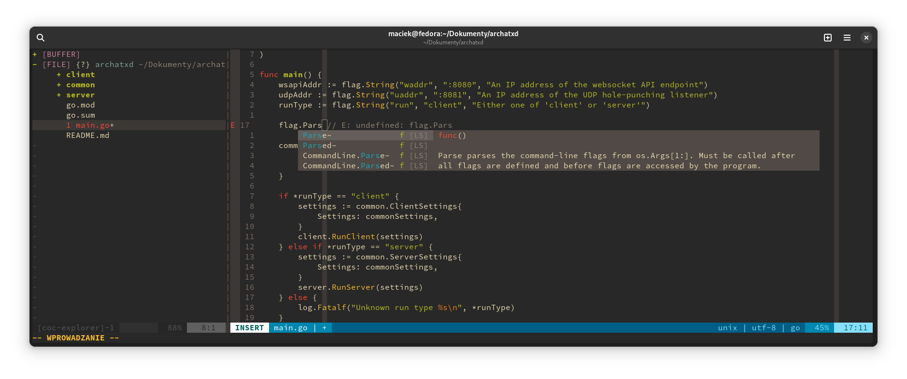

# My .vimrc
This repository serves as an easily available instruction on how to configure vim for painless development :)



## Instructions
0. Copy the .vimrc from this repository inside your home directory
1. Install vim-plug
```bash
curl -fLo ~/.vim/autoload/plug.vim --create-dirs \
    https://raw.githubusercontent.com/junegunn/vim-plug/master/plug.vim
```
2. Open vim and run
```
:PlugInstall
```
3. Install NodeJS (it will allow CoC to work) according to the instructions from https://nodejs.org/en/download/package-manager/
```
# installs nvm (Node Version Manager)
curl -o- https://raw.githubusercontent.com/nvm-sh/nvm/v0.39.7/install.sh | bash

# download and install Node.js (you may need to restart the terminal)
nvm install 20

# verifies the right Node.js version is in the environment
node -v # should print `v20.14.0`

# verifies the right NPM version is in the environment
npm -v # should print `10.7.0`
```
4. Install Golang using:
```
apt install golang-go
``` 
Run this to install gopls and other vim-go dependencies
```
:GoInstallBinaries
```
5. Install Go autocompletions addon
```
:CocInstall coc-go
```
6. Install coc-explorer addon, which allows to display file tree in the panel
```
:CocInstall coc-explorer
```
7. Install coc-pyright addon, which will act as Python3 linter and display autocompletions
```
:CocInstall coc-pyright
```
8. Have a good code day!